```{r setup, include=FALSE}
knitr::opts_chunk$set(echo = TRUE)
suppressWarnings(suppressMessages(library(stats4)))
suppressWarnings(suppressMessages(library(tidyverse)))
suppressWarnings(suppressMessages(library(Matrix)))
```


# Writeup #

### Introduction ###
In everyday life, we are regularly asked to navigate between internal representations of particular quantities or values and the formal systems used to describe them. Acquiring this mapping based on experience with these systems allows us to move back and forth between our own subjective representations and formal estimates (mostly) effortlessly, despite the fact that learning such a mapping is a computationally challenging task. Prior work has shown that people's representations of risk and prospective gains can be accounted for by sampling from informative priors on e.g. past gains and basic manipulations such as rank ordering among those samples (see Stewart, Chater, & Brown 2006). Here we take a similar approach in attempting to model people's estimates of numerosity. We present two ways of modeling this problem, one which uses an MCMC-based sampling process on number mapping "slopes", and another which tries to make number estimates based only on relative magnitudes of previous samples. While the first model offers little towards solving this problem, the second presents the possibility of explaining certain features of our mapping from internal quantity representations to numbers using only primitives of magnitude comparison and expectations around the general distribution of large numbers. 

### Modeling Number Estimates: MCMC Model ###
Prior work on number estimation has shown that in addition to variance in estimate calibration *across* participants, calibration of high numerosity estimates varies *within* individuals: in other words, an individual's mapping from magnitude to number estimate "drifts" over time (Vul, Barner, & Sullivan 2013). A model of human number estimation should capture this drift in calibration. If we imagine a given set of estimates as having a "slope" that describes the relationship between the true numbers a person sees and their estimates of those numbers, then the drift in calibration can be expressed as decreasing correlation between these slopes over time. One simple approach to modeling the drift, which we call the "naive MCMC" model, is to sample a slope parameter from some prior distribution. Over a large set of trials, the sampled slopes will estimate the posterior on slope, but over individual trials or blocks of trials, the slopes used to form estimates may have varying correlation. Specifically, the mechanics of MCMC processes should produce slopes that are correlated at close distances but less so as trial "distance" increases, producing the sort of "drift" described by Vul et al. (2013). 
### MCMC Model Results ###
Our naive MCMC model samples slopes from a distribution centered at 1 for each trial using a Metropolis-Hastings MCMC process and produces a number estimate on a given trial based on the slope at that trial. We designate 24 separate model "participants" that each perform the same 300 trials as actual participants in a prior experiment. We then analyze model data in the same manner as original participant data, fitting slopes to blocks of individual participant estimates using maximum likelihood estimation and comparing pointwise correlations in these fitted slopes across blocks for all participants. The results of this analysis for both model data and participant data are shown below.

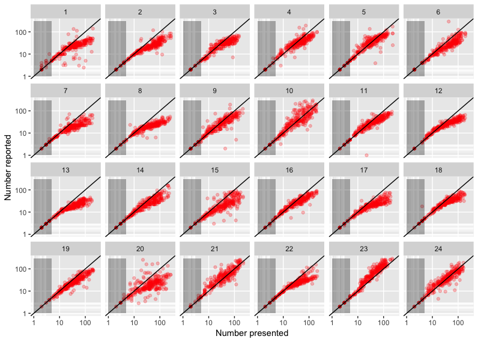

Above is participant estimates from the original experiment.

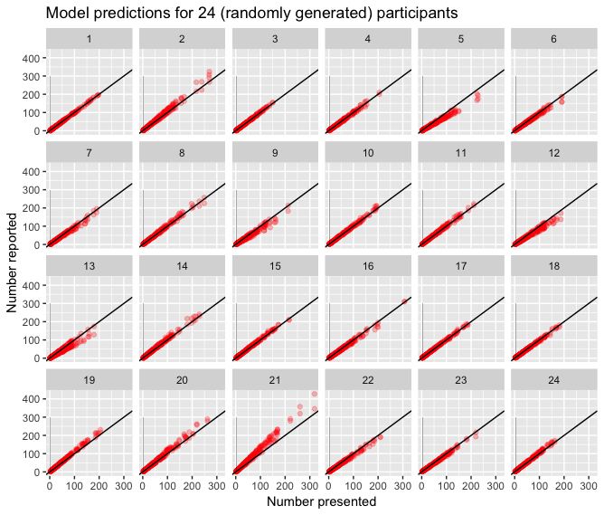

Here we see equivalent data for the MCMC model participants. 

Below we see correlation in slopes by block across actual participants.

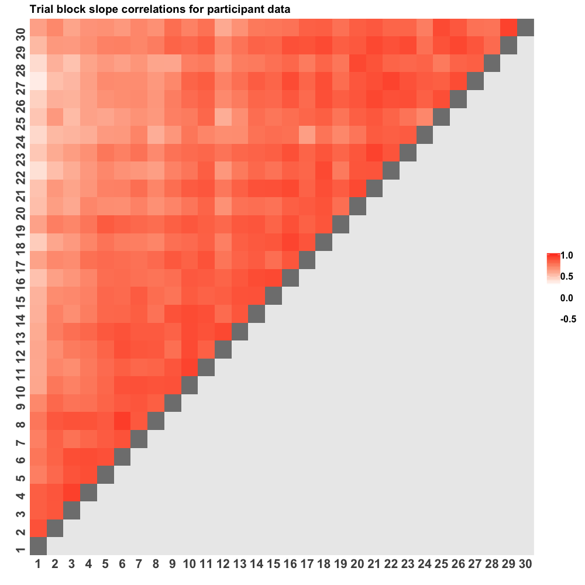

Below is the same correlation in slopes by block for model data.

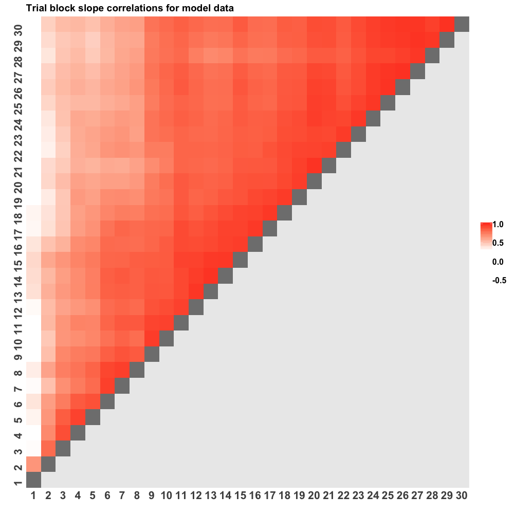

Based on the correlation across blocks, we calculate correlation in slopes at greater trial distances across participants. Shown here is original participant data.

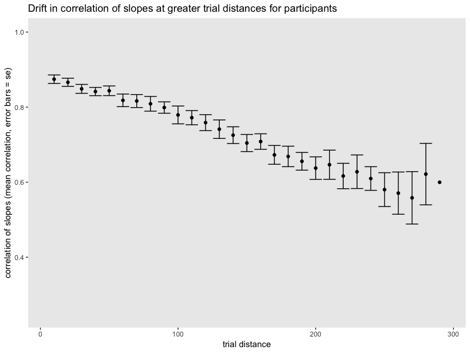

The same analysis on the MCMC model data produces the drift below.

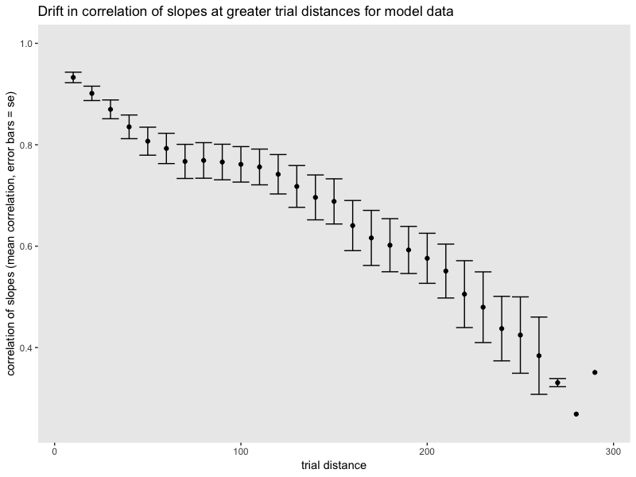


### MCMC Model Analysis ###
The results from the MCMC model qualitatively resemble the human data. There is substantially more "drift" at higher trial distances for the model, but this can be tweaked in the MCMC process itself. The more critical shortcoming is that this model does little to explain the actual mechanism by which people map from number magnitude to numerosity. The "slope" of their magnitude to number estimates is in effect this mapping, so by sampling over slopes we more or less presuppose the mapping. At best, this model shows that the sort of "drift" we see in human number estimates can be approximated with a simple MCMC-based model. We attempt to resolve this shortcoming with the contrained sampling model.


### Modeling Number Estimates: Constrained Sampling Model ###
In order to more accurately capture human number estimates without building a mapping from magnitude to number into the model itself, we attempt a model in the style of Stewart et al. (2006). We assume only basic prior information and processing of individual number estimates to try and produce behavior which broadly resembles human mapping from magnitude to number. This model takes as a starting point a prior on number estimates which assumes that we are more likely to see smaller numbers than large ones: this is expressed as a power law on number probability. Next, we assume that people have access to some number of previous number estimates to help with the current estimate. A goal of this model is to produce sensible human-like behavior without the "calibration" parameter of previous trials being too high. The intuition is that a given estimate will likely draw on the ones before it and even on some pre-existing knowledge how known magnitudes map to number. How to build in this assumption without giving the model *too much* existing mapping will be a key challenge in future work. For now, we simply assume that the model has access to a certain number of previous trials' "magnitudes" and the corresponding number estimates that were produced based on those magnitudes. Finally, the model has the ability to estimate how likely it is that the magnitude of the current trial is greater or smaller than each of the previous trials it is able to sample. Armed with this comparison, the model uses the probability that the current magnitude is greater than each of the previous N magnitudes to estimate a stepwise likelihood function for the current magnitude defined over the space of number estimates (using the number estimates from each of the previous N trials it samples). This allows the model to estimate a maximum a posterior distribution on number estimates for the current trial magnitude by simply comparing it to the magnitudes of previous trials and their corresponding number estimates. 

### Constrained Sampling Model: Results ###

Results from a set of 300 estimates for 100, 50, and 25 "calibration" trials are shown below in red, with actual participant data in blue for reference. In this data, the model is simply taking a sample from the posterior as its estimate, but results are similar if the model takes the mean of the posterior instead. 

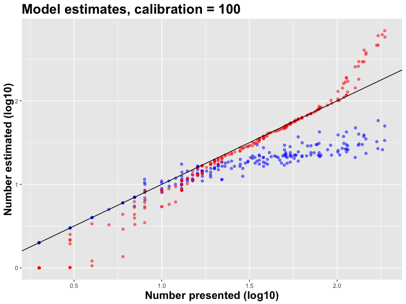
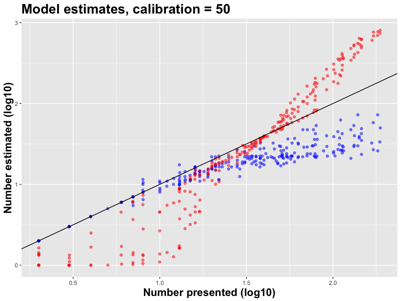

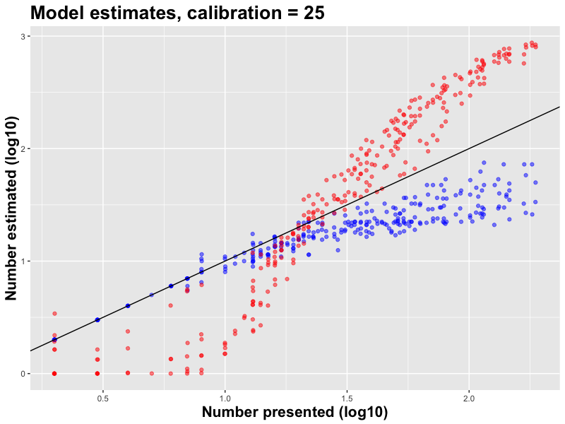

In the model results above, we see that the model is fairly accurate with 100 calibration trials, but by 50 its performance deteriorates and with only 25 calibrations the model performs poorly. In particular, the model consistently underestimates low numbers and overestimates high numbers, which is not at all characteristic of human number estimation and reveals a flaw in the way the model is constructed.

### Constrained Sampling Model: Analysis ###
The results from the constrained sampling model show a consistent under estimation of low numbers and an overestimation of high numbers. This is due to the fact that if the model initially overestimates a high number, then for all subsequent trials which have a magnitude greater than the one which produced the original overestimate, they will have a high likelihood of a number estimate even *greater* than the original overestimate (since the magnitude is greater). The same goes for underestimates in the opposite direction. This produces a sort of "race to the top/bottom" for high and low estimates. Human intuition helps us avoid these problems: when I see a number whose magnitude is higher than previous trials, I'm still able to produce a relatively accurate estimate and my future estimates are not tightly constrained by my initial over or underestimate. Faced with 240 dots, I'm not likely to estimate that it's 800, and if I see 300 dots on a later trial, I don't consequently assume that this must be *even more* than 800. This is in effect what the model does: the graph below shows model estimates in red and actual numbers in blue over 300 trials: it's evident that early over or underestimates tie the model's proverbial hands on later estimates that have a higher or lower magnitude

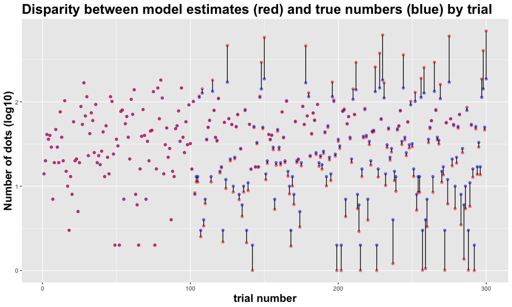

### Future Directions ###
Future work will mostly focus on finding ways to mitigate the constrained sampling model's over and underestimate behavior. This will likely require some form of "scaffolding" whereby the model, even when presented with a number higher or lower than what it has seen in previous trials, knows that there is an upper or lower limit to this estimate beyond that enforced by the prior. In this way, the model's estimates for high and low magnitudes will stay closer to the true number.  


### References ###
Stewart, N., Chater, N., & Brown, G. D. (2006). Decision by sampling. Cognitive psychology, 53(1), 1-26.

Vul, E., Barner, D., & Sullivan, J. (2013). Slow drift of individuals' magnitude-to-number mapping. In Proceedings of the Annual Meeting of the Cognitive Science Society (Vol. 35, No. 35).


# Appendix: Code and Plot Generation #

Here we show modeling code and results for two models of counting drift: the "constrained sampling" model and a "naive MCMC" model. 

```{r globals, eval = FALSE}
DATA_PATH = '../numexpt/data/'
SAMPLE_PARTICIPANT = 17

DEBUG = FALSE

# Global functions for graphing
my.log.breaks = function(lims){
  majors = seq(floor(log10(lims[1])), ceiling(log10(lims[2])), by = 1)
  minors = log10(unlist(lapply(majors[-1], function(x){seq(10^(x - 1), 9 * 10^(x - 1), by = 10^(x - 1))})))
  return(list(majors, minors))
}

mylogx = function(lims){
  breaks = my.log.breaks(lims)
  scale_x_log10(limits = lims, 
                breaks = 10^breaks[[1]], 
                minor_breaks = breaks[[2]])
}

mylogy = function(lims){
  breaks <- my.log.breaks(lims)
  scale_y_log10(limits = lims, 
                breaks = 10^breaks[[1]], 
                minor_breaks = breaks[[2]])
}

```

# Data Processing #

Reading in participant data on the task. 

```{r data_read, eval = FALSE}
files <- list.files(DATA_PATH)
data <- data.frame()
subject <- 1
for(f in files){
  q = read.csv2(paste(DATA_PATH, f, sep = ""), sep = ",", header = T, colClasses = "character")
  q$subject = subject
  data <- rbind(data, q)
  subject <- subject + 1
}

to.num <- function(x){as.numeric(as.character(x))}

data$run <- to.num(data$run)
data$index <- to.num(data$index)
data$num_dots <- to.num(data$num_dots)
data$answer1 <- to.num(data$answer1) # participant's first guess answer
data$answer2 <- to.num(data$answer2) # participant's second guess answer
data$points1 <- to.num(data$points1) # participant's points earned for their first guess
data$points2 <- to.num(data$points2) # participant's points earned for their second guess
data$time <- to.num(data$time) # participant's response time
data$answer <- 10 ^ (log10(pmax(1, data$answer1)) / 2 + log10(pmax(1, data$answer2)) / 2) # blended average of participant answers for this array
  
```

### Visualizing Participant Data ###


In the above image, we see that estimate calibration varies *across* participants, with some over and others underestimating. Below is the code to generate this graph, for reference. 

```{r participant_vis, eval = FALSE}
ggplot(data, aes(x = num_dots, y = answer)) +
  geom_point(alpha = 0.25, color = "red") +
  geom_abline(position = "identity") +
  mylogx(c(1,300)) +
  mylogy(c(1,300)) +
  xlab("Number presented") +
  ylab("Number reported") +
  annotate("rect", xmin = 1, xmax = 5, ymin = 1, ymax = 300, fill = "black", alpha = 0.3) +
  facet_wrap(~subject, ncol = 6)

```

# Constrained Sampling Model #
This model tries to reproduce behavior similar to human estimates assuming the participant only has access to a number of previous trials' magnitudes, the corresponding estimates on those trials, and probability that the current magnitude is greater or larger than each of the previous magnitudes. It assumes a prior on number estimates that favors lower numbers. 

### Participant Trials ###
We first sample participant trials to use in subsequent modeling.

```{r sample_data, eval = FALSE}
data.model = data %>%
  select(subject, run, index, num_dots, answer) %>% # Note including answer only relevant for eventual comparison
  rename(participant.answer = answer) %>% # rename to avoid any confusion
  mutate(trial = ((run - 1) * max(index)) + index, # get true trial number (1-300) for each participant
         answer_estimate = 0) # initially set this to 0
# glimpse(data.model)

# Get single participant's data for easier initial modeling
single.subj = data.model %>%
  filter(subject == SAMPLE_PARTICIPANT)
glimpse(single.subj)

```


### Running the model ###
Next, we run the constrained sampling model with sample participant trials gathered above.

```{r constrained_sampling, eval = FALSE}

# Globals for constrained sampling model
PERCEIVED_DOTS_NOISE_SD = 0.01 # log noise of perceived magnitude: this may require some fiddling
ESTIMATE_CALIBRATION = 50 # number of previous trials to reference in calculating answer estimate
MAX_ESTIMATE = 1000 # highest number a participant will estimate
PRIOR_EXP = -1 # exponent slope of prior: tweak this as needed


# matrix of number estimates initialized for use in calculation of likelihoods in loop below
A = matrix(rep(1:MAX_ESTIMATE, each = ESTIMATE_CALIBRATION), nrow = ESTIMATE_CALIBRATION)
for (trial.i in seq(1, max(single.subj$trial))) { # over all trials
  if (DEBUG){print(paste('trial: ', trial.i, sep = ''))} # show progress
  if (trial.i <= ESTIMATE_CALIBRATION) {
    # set first ESTIMATE_CALIBRATION values to be a sample from a distribution around the true number of dots
    # NB: samples in log space with low SD so that samples will be closer to real numbers at low n, farther at high n
    single.subj$answer_estimate[trial.i] = 10 ^ rnorm(1, log10(single.subj$num_dots[trial.i]), PERCEIVED_DOTS_NOISE_SD)
    if (DEBUG) {print(paste("-> estimate: ", single.subj$num_dots[trial.i]))}
  } else {
    # fetch previous trials for magnitude comparison
    comparison.trials = seq(trial.i - ESTIMATE_CALIBRATION, trial.i - 1)
    prev.vals = single.subj %>%
      filter(trial %in% comparison.trials)
    
    # compare magnitude of trial.i to previous trials
    curr.trial.mag.mean = single.subj$num_dots[single.subj$trial == trial.i]
    prev.vals = prev.vals %>%
      mutate(p.mag.greater = 1 - pnorm(0, mean = log10(curr.trial.mag.mean) - 
                                         log10(num_dots), sd = sqrt(2 * PERCEIVED_DOTS_NOISE_SD)))

    # discretize possible answer estimates, set log likelihood at each value to be either p.mag.greater or 1 - p.mag.greater
    # use matrix with a row for each of the previous trials and a column for each candidate estimate value.
    # each row,col element in X is the log likelihood that the magnitude on the current trial maps to the column value, 
    #   given the magnitude and corresponding estimate in that row's trial
    X = matrix(0, nrow = ESTIMATE_CALIBRATION, ncol = MAX_ESTIMATE) # Initialize matrix for storing log likelihoods
    # matrix storing proability in each col that magnitude on this trial is < magnitude in trial indicated by that row
    P = matrix(rep(1 - prev.vals$p.mag.greater[1:ESTIMATE_CALIBRATION], MAX_ESTIMATE), nrow = ESTIMATE_CALIBRATION)
    # matrix storing numerical estimate generated for each previous trial
    B = matrix(rep(floor(prev.vals$answer_estimate[1:ESTIMATE_CALIBRATION]), MAX_ESTIMATE), nrow = ESTIMATE_CALIBRATION)
    X[A < B] = log10(P[A < B])
    X[A >= B] = log10(1 - P[A >= B])
    # across each previous trial that we've calculated a log likelihood vector for above, calculate aggregate likelihood for estimates
    new.loglik = data.frame('number.est' = seq(1:MAX_ESTIMATE), 'sum.loglik' = colSums(X))

    # process log likelihoods obtained above (add constant factor, re-convert to probability space, and normalize)
    new.loglik = new.loglik %>%
      mutate(prior = number.est ^ PRIOR_EXP,
             prior.norm = prior / sum(prior),
             sum.loglik = sum.loglik - max(sum.loglik),  #add a constant C to each value in new.loglik to make it more reasonable
             loglik.probability.raw = 10 ^ sum.loglik, # reconvert out of log space
             posterior.raw = loglik.probability.raw * prior.norm, # multiply loglik by the prior
             posterior.norm = posterior.raw / sum(posterior.raw)) # normalize
             
    
    # sample output numerical estimate from the posterior
    estimate = with(new.loglik, sample(number.est, 1, prob = posterior.norm))
    # OR use the posterior mean as our estimate
    # estimate = sum(new.loglik$number.est * new.loglik$posterior.norm)
    
    single.subj$answer_estimate[single.subj$trial == trial.i] = estimate
    
    if (DEBUG) {print(paste("-> estimate: ", estimate))}
    if (DEBUG) {print(paste("-> true number: ", single.subj$num_dots[single.subj$trial == trial.i]))}
  }
}

```


### Visualizing Model Distributions ###
Below, we see sample log likelihood and posterior estimates for a given trial.

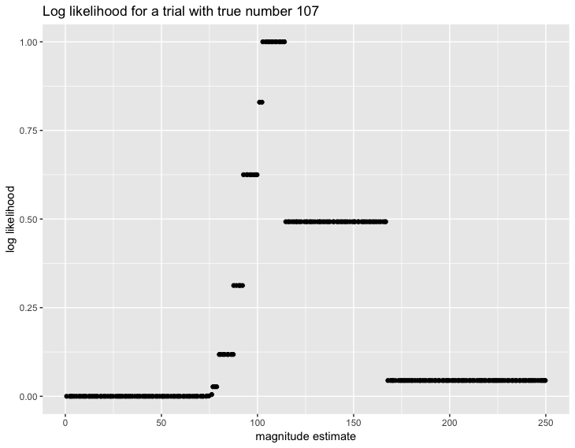

In the log likelihood estimates above, we can clearly see the influence of previous trials that had larger estimates than the current one, around 115 and 168.

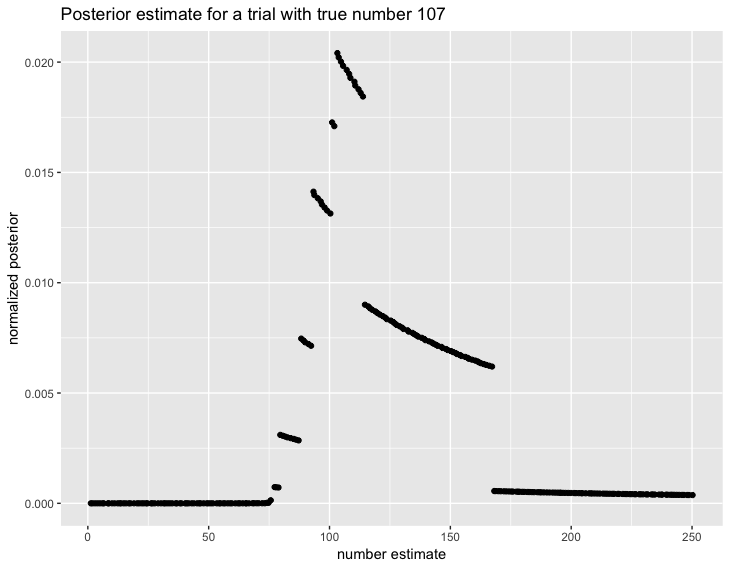

In the posterior estimates above, we can see the influence of the prior on each of the stepwise segments of the log likelihood.

### Model Results ###
The model outputs estimates for each of the 300 trials taken from the original participant data. Below, we see model results for various numbers of calibration trials (model data shown in red alongside participant data in blue). These figures only show the model's estimates *after* the calibration trials.


With 100 calibration trials, the model is fairly accurate, but the poor estimates at the very low and high end of the number range are puzzling.


With 50 calibration trials, we to see reasonable accuracy in a small range for central numbers but poor low and high estimates have crept in towards the middle of the number range.


With 25 calibration trials, the model performs poorly across most of the number range.


### Analyzing model failures ###
In order to better understand why the model does increasingly poorly at the low and high ends of the number range, we look at the disparity between true number and model estimates on each trial. If the model makes a large over or underestimate on a given trial, then any subsequent trials where the number (and hence the magnitude) is lower than an initial underestimate or higher than an initial overestimate will produce even *more* of an over or underestimate. This is visible in the graph below.

Below we see a comparison of model estimates to true number by trial, with model estimates in red and true number in blue. Note how a particularly high or low estimate causes degradation in subsequent trials.


Generating the plots above (this code is here primarily for reference).
```{r plot_model, eval = FALSE}

# Validating log likelihood and posterior estimates
new.loglik %>% 
  filter(number.est %in% seq(1:250)) %>% 
  ggplot(aes(x = number.est, y = loglik.probability.raw)) + 
  geom_jitter() +
  ggtitle("Log likelihood for a trial with true number 107") +
  labs(x = "magnitude estimate", y = "log likelihood")

new.loglik %>% 
  filter(number.est %in% seq(1:250)) %>% 
  ggplot(aes(x = number.est, y = posterior.norm)) + 
  geom_jitter() +
  ggtitle("Posterior estimate for a trial with true number 107") +
  labs(x = "number estimate", y = "normalized posterior")

# Graph model performance alongside sample participant data
single.subj %>%
  filter(trial > ESTIMATE_CALIBRATION) %>%
  ggplot(aes(x = log10(num_dots))) +
  geom_jitter(aes(y = log10(participant.answer)), color = 'blue', alpha = 0.5) +
  geom_jitter(aes(y = log10(answer_estimate)),  color = 'red', alpha = 0.5) +
  geom_abline() +
  ggtitle(paste0("Model estimates, calibration = ", ESTIMATE_CALIBRATION)) +
  theme(axis.title = element_text(size = 16, face = "bold"),
        plot.title = element_text(size = 20, face = "bold"))

# Graph disparity between true number and model estimates on each trial
single.subj %>%
  #filter(trial > ESTIMATE_CALIBRATION) %>%
  ggplot(aes(x = trial)) +
  geom_point(aes(y = log10(num_dots)), color = 'blue', alpha = 0.5) +
  geom_point(aes(y = log10(answer_estimate)), color = 'red', alpha = 0.5) +
  geom_segment(aes(y = log10(num_dots), yend = log10(answer_estimate), xend = trial))

```

### Future Directions ###
Next steps for the constrained sampling model will be to manage the over and underestimation at the extremes shown in the figures above. This may require giving the model a certain degree of existing calibration so that it doesn't wildly overestimate high numbers and is relatively accurate at low numbers.


# Naive MCMC Model #
Here, we present a "naive MCMC" model that samples slope parameters and produces number estimates accordingly. This is primarily to show that the drift in calibration slope can be represented through a sort of Monte Carlo sampling process, though ultimately this model fails to produce meaningful insights about how people map from magnitude to number since it takes that mapping as a starting point by sampling slopes.

### MCMC Support Functions ###
Below is code to run the MCMC slope sampling process for a set of trials.

```{r mcmc_setup, eval = FALSE}
# MCMC globals
PROPOSAL_JITTER_MEAN = 0 # this is probably the only reasonable choice
PROPOSAL_JITTER_SD = 0.01 # this is tweakable

SLOPE_PRIOR_MEAN = 1 # used to score new proposals
SLOPE_PRIOR_SD = 1 # used to score proposals: changes here have somewhat dramatic effects, worth looking into

PARTICIPANTS = 24
ITERATIONS = 300

# Support functions
propose.params = function(params) {
  new.slope = params[['slope']] + rnorm(1, PROPOSAL_JITTER_MEAN, PROPOSAL_JITTER_SD)
  return(list('slope' = new.slope))
}

score.params = function(params) {
  prior.score = log(dnorm(params[['slope']], SLOPE_PRIOR_MEAN, SLOPE_PRIOR_SD))
  # no need to compute likelihood | data here, we just imagine that every slope is a new sample
  return(prior.score)
}

accept.proposal = function(curr.params.score, proposal.score) {
  cutoff = runif(1)
  mh.ratio = exp(curr.params.score - proposal.score)
  return(cutoff < mh.ratio)
}

run.mcmc = function(start.params, iterations) {
  chain = list(start.params)
  chain.scores = score.params(start.params)
  for (i in 2:iterations) {
    curr.params = chain[[i-1]]
    curr.score = chain.scores[i-1]
    proposal = propose.params(curr.params)
    proposal.score = score.params(proposal)
    if (accept.proposal(curr.score, proposal.score)) {
      chain[[i]] = proposal
      chain.scores[i] = proposal.score
    } else {
      chain[[i]] = curr.params
      chain.scores[i] = curr.score
    }
  }
  return(list(chain, chain.scores))
}


```


### Run MCMC ###
Below is code to generate a sample set of 300 slope estimates as an experiment participant would on each trial, using the MCMC process outlined above.

```{r mcmc_run, eval = FALSE}
start.params = list('slope' = SLOPE_PRIOR_MEAN) # conservative starting slope

# Run MCMC for all participants
mcmc.exp = list('subj' = numeric(), 'chain' = c(), 'scores' = c())
for (x in seq(1:participants)) {
  mcmc.participant = run.mcmc(start.params, iterations)
  mcmc.exp[[x]] = list('subj' = x, 'chain' = mcmc.participant[[1]], 'scores' = mcmc.participant[[2]])
}

```


## Visualizing MCMC Results ###

We can view the slopes sampled by the model for a sample participant over 300 trials (these are not log transformed).

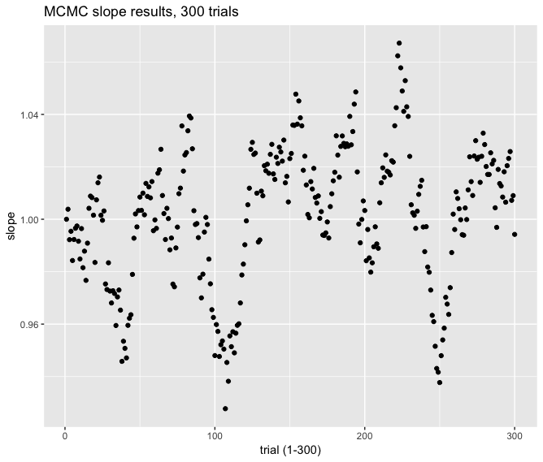

Below is code to generate the above visualization.
```{r mcmc_vis, eval = FALSE}
tidy.params = function(l.params) {
  df.params = data.frame('slope' = NA)
  for (n in names(l.params)){
    df.params[[n]] = l.params[[n]]
  }
  return(df.params)
}

# Convert to data frame for each subject
exp.df = list('subj' = numeric(), 'mcmc.df' = data.frame())
for (x in seq(1:participants)) {
  chain = mcmc.exp[[x]]$chain
  chain.df = map_dfr(chain, tidy.params)
  
  chain.scores = mcmc.exp[[x]]$scores
  
  mcmc.df = data.frame('iter' = 1:iterations,
                       'slope' = chain.df$slope,
                       'score' = chain.scores)
  exp.df[[x]] = list('subj' = x, 'mcmc.df' = mcmc.df)
}

# plot slopes
exp.df[[1]]$mcmc.df %>%
  ggplot(aes(x = iter, y = slope)) +
  geom_point() +
  labs(x = "trial (1-300)", y = "slope")

# plot scores 
exp.df[[1]]$mcmc.df %>%
  ggplot(aes(x = iter, y = score)) +
  geom_point() +
  labs(x = "trial (1-300)", y = "score")
```


## Using MCMC results to reproduce experiment analysis ##

Below we run code to put the MCMC model through the experiment as for 24 model "participants" so we can compare the drift in actual participant slopes over 300 trials to the model drift.

```{r mcmc_experiment, eval = FALSE}
# Globals
PERCEIVED_DOTS_NOISE_MEAN = 0
PERCEIVED_DOTS_NOISE_SD = 1

# Add true_index for each participant
data.model = data %>%
  select(subject, run, index, num_dots) %>% # Note including answers may not be relevant
  mutate(trial = ((run - 1) * max(index)) + index)

# Add noisy perceived_dots based on num_dots
# Add slope_est from MCMC process for each (participant, true_index) trial
# Add number_est using slope_est and perceived_dots
# NB: trying to do all of this in mutate call above causes strange recursion bottoming out errors for slope_est calculation
data.model = data.model %>%
  group_by(subject, trial) %>%
  mutate(perceived_dots = num_dots + rnorm(1, PERCEIVED_DOTS_NOISE_MEAN, PERCEIVED_DOTS_NOISE_SD), # random noise in perception of true magnitude
         slope_est = exp.df[[subject]]$mcmc.df$slope[exp.df[[subject]]$mcmc.df$iter == trial],
         number_est = slope_est * perceived_dots) # TODO what to do about non-integer perceived_dots and hence non-integer number_est?

```


### Visualize experimental MCMC ###
Below we see a graph similar to the one above, but this is based on 24 MCMC "participants". 


In this image, we see that most of the data stays close to the identity line. 

This code generates the image above.
```{r mcmc_experiment_vis, eval = FALSE}
# Visualize data in same manner as above
ggplot(data.model, aes(x = num_dots, y = number_est)) +
  geom_point(alpha = 0.25, color = "red") +
  geom_abline(position = "identity") +
  mylogx(c(1, 300)) +
  mylogy(c(1, 300)) +
  xlab("Number presented") +
  ylab("Number reported") +
  ggtitle("Model predictions for 24 (randomly generated) participants") +
  annotate("rect", xmin = 1, xmax = 5, ymin = 1, ymax = 300, fill = "black", alpha = 0.3) +
  facet_wrap(~subject, ncol = 6)
```


### Drift Analysis with MCMC Results ###
Based on the experiment results above, we can visualize drift across trial blocks and trial distances for MCMC model data. This is compared with similar plots of participant trials. 

Below we see correlation in slopes across trial blocks for model data.


The correlation between arbitrary blocks of trials above allows us to calculate the slope correlations at arbitrary trial *distances*, shown below for model data.


### Human Participant Comparison ###
These plots can be compared to the same plots based on participant data below.

Below we see correlation in slopes by block across participants.


Based on the above, we calculate correlation in slopes at greater trial distances across participants.


### Code for slope correlation analysis ###
The plots for model and participant data are generated using the code below (shown here for reference).

The section below generates the data to plot slope correlations by trial block.
```{r mcmc_block_analysis, eval = FALSE}
# Supporting functions
BLOCKSIZE = 30

# bi-linear power-law mapping
map.bipower <- function(x, a, b){
  crit <- a
  slope <- 10^b
  lx <- log10(x)
  ly <- ((lx > crit) * (crit + (lx - crit) * slope) + (lx <= crit) * lx);
  return(10^ly)
}

## general log likelihood function (with robustness)
loglik <- function(x, y, map.fx, a, b, s, p){
  sum(
    pmax(-6, dnorm(log10(y) - log10(map.fx(x, a, b)), 0, s, log = T))
  )
}

brutefit <- function(tmp){
  nLL <- function(a, b, s){
    -loglik(tmp$perceived_dots, tmp$number_est, usefx, a, b, 10^s) + priors[[1]](a) + priors[[2]](b) + priors[[3]](s)
  }
  
  iter = 0
  fits = NULL
  fit = NULL
  while(is.null(fits)){
    try(fit <- summary(mle(nLL, 
                           start = list(a = runif(1, ps["ma"], ps["sa"]), 
                                      b = runif(1, ps["mb"], ps["sb"]), 
                                      s = rnorm(1, ps["ms"], ps["ss"])))), TRUE)
    iter = iter + 1
    
    if(!is.null(fit)){
      fits <- c(tmp$subject[1], -0.5 * fit@m2logL, length(tmp$perceived_dots), fit@coef[,"Estimate"])
    } else {
      if(iter > 50){
        fits <- c(tmp$subject[1], -9999, 0, 0, 0, 0)
      }      
    }
  }
  names(fits) <- c("subject", "logL", "n", "a", "b", "s")
  return(fits)
}

# function call setup copied from fit.block-models.2014-06-06.R
usefx <- map.bipower
ps = c(0.7, 1.5, -0.5, 0.2, -0.7, 0.2)
names(ps) <- c("ma", "sa", "mb", "sb", "ms", "ss")
priors = list()
priors[[1]] <- function(x){-dnorm(x, 1.14, 0.1, log = T)} #
priors[[2]] <- function(x){-dnorm(x, -0.1, 0.25, log = T)} #
priors[[3]] <- function(x){-dnorm(x, -1, 0.05, log = T)} # 

splitBlock <- function(trial, n){floor((trial - 1) / (iterations / n))}

# Fit slopes
# NB: this can take a few minutes
ns = c(BLOCKSIZE)
xcorBlock = list()
dcor = list()
for (i in 1:length(ns)){
  n = ns[i]
  fitsBlock = list()
  for (k in 1:n) {
    tmp <- subset(data.model, splitBlock(data.model$trial, n) == (k - 1))
    fitsBlock[[k]] <- data.frame(do.call(rbind, by(tmp, tmp$subject, brutefit)))
  }
}

namedSlopes = function(x) {
  z = data.frame(x$b)
  rownames(z) = x$subject
  return(z)
}

cbind.fill = function(...){
  nm = list(...) 
  rnames = unique(unlist(lapply(nm, rownames)))
  nm = lapply(nm, function(x) {
    newrows = rnames[!rnames %in% rownames(x)]
    newentries = matrix(nrow = length(newrows), ncol = ncol(x))
    rownames(newentries) = newrows
    colnames(newentries) = colnames(x)
    x = rbind(x, newentries)
    return(x)
  })
  nm = lapply(nm, function(x) {
    y = data.frame(x[order(as.numeric(rownames(x))),])
    rownames(y) = as.character(sort(as.numeric(rownames(x))))
    colnames(y) = colnames(x)
    return(y)
  })
  return(do.call(cbind, nm))
}


# Get correlations from slopes fit above
s1 = do.call(cbind.fill, lapply(fitsBlock, namedSlopes))
R = cor(s1, s1, use = "pairwise.complete.obs")
rownames(R) = c()
colnames(R) = c()
mcor = reshape::melt(R)
names(mcor) = c("Var1", "Var2", "value")
mcor = mcor[mcor$Var1 <= mcor$Var2,]
mcor$value[mcor$Var1 == mcor$Var2] = NA
ggplot(mcor, aes(x = as.factor(Var1), y = as.factor(Var2), fill = value)) + 
  geom_tile() + 
  scale_fill_gradient2(low = "white", mid = "white", high = "red", midpoint = 0.3, limits = c(-0.5, 1))+
  xlab("") + ylab("") +
  ggtitle("Trial block slope correlations for model data") +
  scale_x_discrete(expand = c(0,0)) +
  scale_y_discrete(expand = c(0, 0)) + 
  theme(axis.ticks = element_blank(), 
        axis.text = element_text(size = 16, face = "bold"),
        axis.text.y = element_text(angle = 90),
        legend.title = element_blank(),
        legend.text = element_text(size = 12, face = "bold"),
        title = element_text(size = 12, face = "bold"),
        panel.grid = element_blank())

```


The code below processes the data in order to display slope correlations by trial distance.

```{r mcmc_drift_analysis, eval = FALSE}
cors.dist.blocks = list('dist' = numeric(), 'cors' = c())
for (x in seq(1:(BLOCKSIZE - 1))) {
  cors.dist.blocks[[x]] = list('dist' = x, 'cors' = c())
}

for (row in seq(from = 1, to = dim(R)[1])) {
  for (col in seq(from = row, to = dim(R)[2])) { # NB: this does funky stuff without 'from'
    dist.val = (col - row)
    cor.val = R[row, col]
    if (dist.val > 0 & !is.na(cor.val)) {
      cors.dist.blocks[[dist.val]]$cors = c(cors.dist.blocks[[dist.val]]$cors, cor.val)
    }
  }
}

cor.means.df.blocks = data.frame()
for (x in seq(1:length(cors.dist.blocks))) {
  dist = cors.dist.blocks[[x]]$dist * 10
  mean = mean(cors.dist.blocks[[x]]$cors)
  se = sd(cors.dist.blocks[[x]]$cors) / sqrt(length(cors.dist.blocks[[x]]$cors))
  row = data.frame('dist' = dist, 'mean.cor' = mean, 'se' = se)
  cor.means.df.blocks = rbind(cor.means.df.blocks, row)
}

cor.means.df.blocks %>%
  ggplot(aes(x = dist, y = mean.cor)) +
  geom_point() +
  geom_errorbar(aes(x = dist, ymin = mean.cor - se, ymax = mean.cor + se)) +
  ylim(0.25, 1) +
  labs(x = "trial distance", y = "correlation of slopes (mean correlation, error bars = se)") +
  ggtitle("Drift in correlation of slopes at greater trial distances for model data") +
  theme(panel.grid = element_blank())

```


