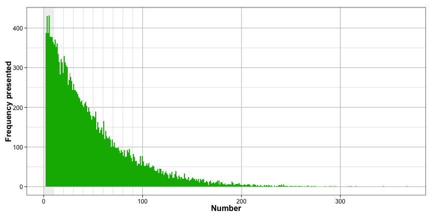
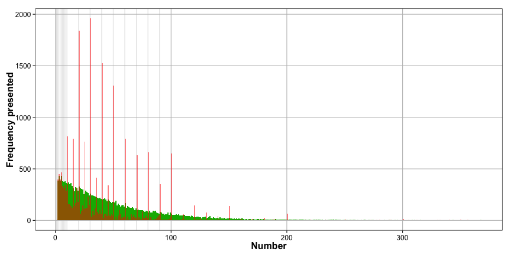
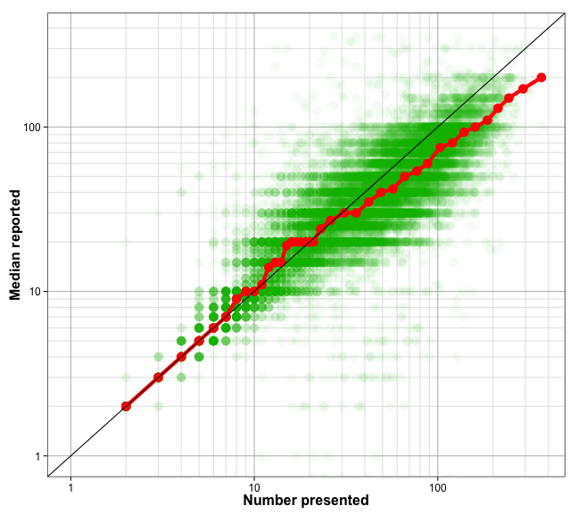
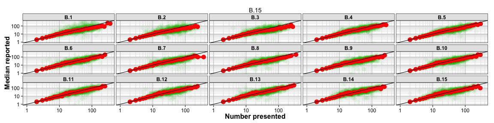
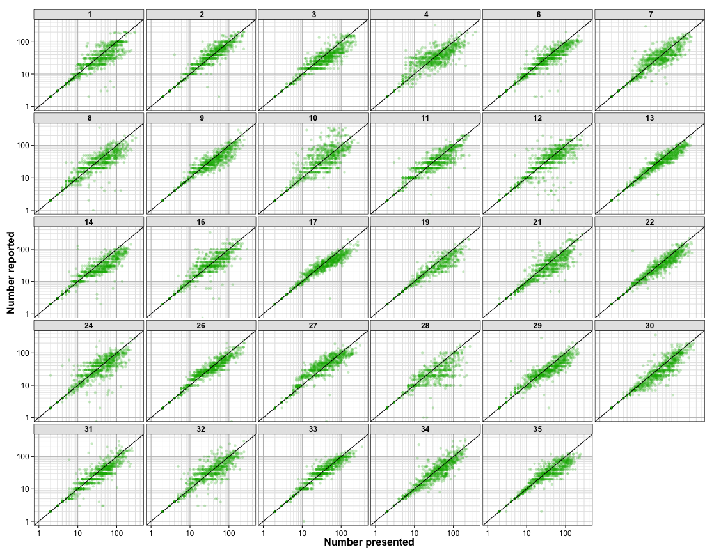

Number experiment analysis
========================================================

Experiment design
--------------------

24 subjects were presented with arrays of dots sampled from a ?? distribution.

They made two guesses about the number of dots on that trial.

Each array was presented twice (on different trials).

Read in and clean data
-------------------

(number subjects sequentially)


```r
source('~/PROJECTS/number-line/numexpt-fb/R/load.fb1.data.R')
source('~/CODE/R/utilities.R')
maincol = rgb(0, 0.7, 0)
seccol = rgb(1,0,0)
```

Drop outliers
------


Basic Checks
-------------

What is the overall histogram of presented numbers?

```r
xlims <- c(1, maxn)
xbreaks <- my.log.breaks(xlims)
ggplot(dat, aes(x=num_dots)) +
  geom_histogram(fill=maincol, binwidth=1) +
  xlab("Number") +
  ylab("Frequency presented") +
  scale_x_continuous(limits=xlims, minor_breaks=10^xbreaks[[2]])+
  mytheme
```

 

```r
ggplot(dat, aes(x=num_dots)) +
  geom_histogram(alpha=1.0, fill=maincol, binwidth=1) +
  geom_histogram(data=dat, aes(x=answer), fill=seccol, alpha=0.5, binwidth=1) +
  xlab("Number") +
  ylab("Frequency presented") +
  scale_x_continuous(limits=xlims, minor_breaks=10^xbreaks[[2]])+
  scale_y_continuous(minor_breaks=c())+
  mytheme
```

 


Overall calibration over all subjects and subsets


```r
ylims = xlims
cuts <- c(1.5:20.5, 10^seq(log10(21.5), log10(maxn), length.out=20))
dat$bin <- cut(dat$num_dots, breaks=cuts, labels=seq_len(length(cuts)-1), include.lowest=T)
truens <- cbind(by(dat$num_dots, 
                   dat$bin, 
                   median))
medians <- cbind(by(dat$answer, 
                    dat$bin, 
                    median))
RT <- cbind(by(dat$time, 
               dat$bin, 
               function(x){median(x)}))
errsd <- cbind(by(dat, 
                  dat$bin, 
                  function(x){sd(log10(x$answer)-log10(x$num_dots))}))
acc <- cbind(by(dat, dat$bin, function(tmp){mean(tmp$num_dots == tmp$answer)}))
X <- data.frame(truens=truens[,1], medians=medians[,1], RT=RT[,1], err=1-acc[,1])
ggplot(dat, aes(x=num_dots, y=answer))+
  geom_point(colour=maincol, size=5, alpha=0.05)+
  geom_point(data=X, aes(x=truens, y=medians), colour=seccol, size=5)+
  geom_line(data=X, aes(x=truens, y=medians), colour=seccol, size=2)+
  geom_abline(position="identity")+
  mylogx(xlims)+
  mylogy(ylims)+
  xlab("Number presented")+
  ylab("Median reported")+
  mytheme
```

```
## Warning: Removed 29 rows containing missing values (geom_point).
```

 
Calibration in various subsets of trials


```r
subcuts <- seq(0,750, by=50)
subsets <- lapply(2:length(subcuts), function(i){seq(subcuts[i-1]+1, subcuts[i], by=1)})
subnames <- c(paste("B.", 1:length(subsets), sep=''))
ylims = xlims
X <- data.frame()
for(i in 1:length(subsets)){
  sdat <- subset(dat, dat$trial %in% subsets[[i]])
  sdat$bin <- cut(sdat$num_dots, breaks=cuts, labels=seq_len(length(cuts)-1), include.lowest=T)
  truens <- cbind(by(sdat$num_dots, 
                     sdat$bin, 
                     median))
  medians <- cbind(by(sdat$answer, 
                      sdat$bin, 
                      median))
  RT <- cbind(by(sdat$time, 
                 sdat$bin, 
                 function(x){median(x)}))
  errsd <- cbind(by(sdat, 
                    sdat$bin, 
                    function(x){sd(log10(x$answer)-log10(x$num_dots))}))
  acc <- cbind(by(sdat, sdat$bin, function(tmp){mean(tmp$num_dots == tmp$answer)}))
  X <- rbind(X, 
             data.frame(truens=truens[,1], 
                        medians=medians[,1], 
                        RT=RT[,1], 
                        err=1-acc[,1], 
                        block = rep(subnames[i], length(acc[,1]))))
}
sdat <- dat
sdat$block <- cut(sdat$trial, breaks=subcuts, labels=subnames)
ggplot(sdat, aes(x=num_dots, y=answer))+
    geom_point(colour=maincol, size=5, alpha=0.05)+
    geom_point(data=X, aes(x=truens, y=medians), colour=seccol, size=5)+
    geom_line(data=X, aes(x=truens, y=medians), colour=seccol, size=2)+
    geom_abline(position="identity")+
    mylogx(xlims)+
    mylogy(ylims)+
    xlab("Number presented")+
    ylab("Median reported")+
    ggtitle(subnames[i])+
    mytheme+
    facet_wrap(~block, ncol=5)
```

```
## Warning: Removed 6 rows containing missing values (geom_point).
## Warning: Removed 3 rows containing missing values (geom_point).
## Warning: Removed 2 rows containing missing values (geom_point).
## Warning: Removed 3 rows containing missing values (geom_point).
## Warning: Removed 1 rows containing missing values (geom_point).
## Warning: Removed 1 rows containing missing values (geom_point).
## Warning: Removed 3 rows containing missing values (geom_point).
## Warning: Removed 1 rows containing missing values (geom_point).
## Warning: Removed 2 rows containing missing values (geom_point).
## Warning: Removed 1 rows containing missing values (geom_point).
## Warning: Removed 4 rows containing missing values (geom_point).
## Warning: Removed 2 rows containing missing values (geom_point).
## Warning: Removed 2 rows containing missing values (geom_point).
## Warning: Removed 1 rows containing missing values (geom_point).
## Warning: Removed 1 rows containing missing values (geom_point).
## Warning: Removed 1 rows containing missing values (geom_point).
## Warning: Removed 2 rows containing missing values (geom_point).
## Warning: Removed 1 rows containing missing values (geom_point).
## Warning: Removed 1 rows containing missing values (geom_point).
## Warning: Removed 2 rows containing missing values (geom_point).
## Warning: Removed 1 rows containing missing values (geom_point).
## Warning: Removed 2 rows containing missing values (geom_point).
## Warning: Removed 2 rows containing missing values (geom_point).
## Warning: Removed 1 rows containing missing values (geom_point).
## Warning: Removed 2 rows containing missing values (geom_point).
## Warning: Removed 1 rows containing missing values (geom_point).
## Warning: Removed 2 rows containing missing values (geom_path).
## Warning: Removed 1 rows containing missing values (geom_path).
## Warning: Removed 1 rows containing missing values (geom_path).
## Warning: Removed 1 rows containing missing values (geom_path).
## Warning: Removed 2 rows containing missing values (geom_path).
## Warning: Removed 1 rows containing missing values (geom_path).
## Warning: Removed 1 rows containing missing values (geom_path).
## Warning: Removed 2 rows containing missing values (geom_path).
## Warning: Removed 1 rows containing missing values (geom_path).
## Warning: Removed 2 rows containing missing values (geom_path).
## Warning: Removed 2 rows containing missing values (geom_path).
## Warning: Removed 1 rows containing missing values (geom_path).
## Warning: Removed 2 rows containing missing values (geom_path).
## Warning: Removed 1 rows containing missing values (geom_path).
```

 

Show individual subjects

```r
ylims = xlims
ggplot(dat, aes(x=num_dots, y=answer))+
  geom_point(colour=maincol, size=2, alpha=0.25)+
  geom_abline(position="identity")+
  mylogx(xlims)+
  mylogy(ylims)+
  xlab("Number presented")+
  ylab("Number reported")+
  mytheme+
  facet_wrap(~subject, ncol=6)
```

```
## Warning: Removed 1 rows containing missing values (geom_point).
## Warning: Removed 1 rows containing missing values (geom_point).
## Warning: Removed 5 rows containing missing values (geom_point).
## Warning: Removed 2 rows containing missing values (geom_point).
## Warning: Removed 7 rows containing missing values (geom_point).
## Warning: Removed 2 rows containing missing values (geom_point).
## Warning: Removed 2 rows containing missing values (geom_point).
## Warning: Removed 1 rows containing missing values (geom_point).
## Warning: Removed 1 rows containing missing values (geom_point).
## Warning: Removed 1 rows containing missing values (geom_point).
## Warning: Removed 1 rows containing missing values (geom_point).
## Warning: Removed 1 rows containing missing values (geom_point).
## Warning: Removed 1 rows containing missing values (geom_point).
## Warning: Removed 1 rows containing missing values (geom_point).
## Warning: Removed 1 rows containing missing values (geom_point).
## Warning: Removed 1 rows containing missing values (geom_point).
```

 
