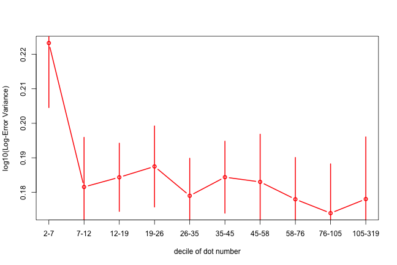

```r
setwd('~/PROJECTS/number-line/numexpt/R/')
rm(list=ls())

source('~/CODE/R/utilities.R')


## load all data and clean up format.
files <- list.files('../data/')
dat <- data.frame()
subject <- 1
for(f in files){
  q = read.csv2(paste('../data/', f, sep=""), sep=",", header=T, colClasses="character")
  q$subject = subject
  dat <- rbind(dat, q)
  subject <- subject+1
}
to.num <- function(x){as.numeric(as.character(x))}
dat$num_dots <- to.num(dat$num_dots)
dat$answer <- 10^(log10(pmax(1, as.numeric(dat$answer1)))/2+log10(pmax(1, as.numeric(dat$answer2)))/2)
dat$trial = 0
for(s in unique(dat$subject)){
  dat$trial[dat$subject==s] = 1:300
}

dat$answer <- as.numeric(dat$answer)
dat$time <- as.numeric(dat$time)
load(file='fake3data.Rdata')
fake$trueans <- fake$answer
fake$answer <- as.numeric(fake$fanswer)
fake$time <- as.numeric(fake$time)
dat <- fake
```

Plot calibrations
-----------------

Medians, a la original paper


```r
cuts <- c(1.5:15.5, 10^seq(log10(16.5), log10(300), length.out=20))
dat$bin <- cut(dat$num_dots, breaks=cuts, labels=seq_len(length(cuts)-1), include.lowest=T)
truens <- cbind(by(dat$num_dots, 
                   dat$bin, 
                   median))
medians <- cbind(by(dat$answer, 
                    dat$bin, 
                    median))
RT <- cbind(by(dat$time, 
               dat$bin, 
               function(x){median(x)}))
errsd <- cbind(by(dat, 
                  dat$bin, 
                  function(x){sd(log10(dat$answer)-log10(dat$num_dots))}))
acc <- cbind(by(dat, dat$bin, function(tmp){mean(tmp$num_dots == tmp$answer1 | tmp$num_dots == tmp$answer2)}))
X <- data.frame(truens=truens[,1], medians=medians[,1], RT=RT[,1], acc=1-acc[,1])
head(X)
```

```
##   truens medians    RT     acc
## 1      2   5.465 1.630 0.01744
## 2      3   7.425 1.540 0.02985
## 3      4   8.462 1.805 0.04286
## 4      5  10.701 2.420 0.08871
## 5      6  11.119 2.660 0.21186
## 6      7  12.475 3.080 0.39759
```

```r
ggplot(X, aes(x=truens, y=medians))+
  geom_point(colour="red", size=5)+
  geom_line(aes(x=truens, y=medians), colour="red", size=2)+
  geom_abline(position="identity")+
  scale_x_log10(limits=c(1, 300), 
                breaks = c(1, 10, 100), 
                minor_breaks=log10(c(1:10, seq(20, 100, by=10), 200, 300)))+
  scale_y_log10(limits=c(1, 300), 
                breaks = c(1, 10, 100), 
                minor_breaks=log10(c(1:10, seq(20, 100, by=10), 200, 300)))+
  xlab("Number presented")+
  ylab("Median reported")+
  mytheme
```

 

Response times by bin.


```r
ggplot(X, aes(x=truens, y=RT))+
  geom_point(colour="red", size=5)+
  geom_line(aes(x=truens, y=RT), colour="red", size=2)+
  scale_x_log10(limits=c(1, 300), 
                breaks = c(1, 10, 100), 
                minor_breaks=log10(c(1:10, seq(20, 100, by=10), 200, 300)))+
  scale_y_continuous()+
  xlab("Number presented")+
  ylab("Response time (seconds)")+
  mytheme
```

 

Accuracy by bin.


```r
ggplot(X, aes(x=truens, y=acc))+
  geom_point(colour="red", size=5)+
  geom_line(aes(x=truens, y=acc), colour="red", size=2)+
  scale_x_log10(limits=c(1, 300), 
                breaks = c(1, 10, 100), 
                minor_breaks=log10(c(1:10, seq(20, 100, by=10), 200, 300)))+
  scale_y_continuous()+
  xlab("Number presented")+
  ylab("Error proportion")+
  mytheme
```

 

Coefficient of variation.


Medians, a la original paper, over scatterplot


```r
ggplot(X, aes(x=truens, y=medians))+
  geom_point(colour="red", size=5)+
  geom_line(aes(x=truens, y=medians), colour="red", size=2)+
  geom_abline(position="identity")+
  scale_x_log10(limits=c(1, 300), 
                breaks = c(1, 10, 100), 
                minor_breaks=log10(c(1:10, seq(20, 100, by=10), 200, 300)))+
  scale_y_log10(limits=c(1, 300), 
                breaks = c(1, 10, 100), 
                minor_breaks=log10(c(1:10, seq(20, 100, by=10), 200, 300)))+
  xlab("Number presented")+
  ylab("Median reported")+
  mytheme
```

 


Aggregate calibration


Plotting the average of the two guesses on one trial versus the actual number on that trial.


```r
ggplot(dat, aes(x=num_dots, y=answer))+
  geom_point(alpha=0.07, colour="red", size=8)+
  geom_point(data=X, aes(x=truens, y=medians), colour="blue", size=5)+
  geom_line(data=X, aes(x=truens, y=medians), colour="blue", size=2)+
  geom_abline(position="identity")+
  scale_x_log10(limits=c(1, 300), 
                breaks = c(1, 10, 100), 
                minor_breaks=log10(c(1:10, seq(20, 100, by=10), 200, 300)))+
  scale_y_log10(limits=c(1, 300), 
                breaks = c(1, 10, 100), 
                minor_breaks=log10(c(1:10, seq(20, 100, by=10), 200, 300)))+
  xlab("Number presented")+
  ylab("Number reported")+
  mytheme
```

```
## Warning: Removed 6 rows containing missing values (geom_point).
```

 


Plotting the average of the two guesses on one trial versus the actual number on that trial.


```r
ggplot(dat, aes(x=num_dots, y=answer))+
  geom_point(alpha=0.5, colour="red")+
  geom_abline(position="identity")+
  scale_x_log10(limits=c(1, 300), 
                breaks = c(1, 10, 100), 
                minor_breaks=log10(c(1:10, seq(20, 100, by=10), 200, 300)))+
  scale_y_log10(limits=c(1, 300), 
                breaks = c(1, 10, 100), 
                minor_breaks=log10(c(1:10, seq(20, 100, by=10), 200, 300)))+
  xlab("Number presented")+
  ylab("Number reported")+
  mytheme+
  facet_wrap(~subject, ncol=6)
```

```
## Warning: Removed 2 rows containing missing values (geom_point).
## Warning: Removed 2 rows containing missing values (geom_point).
## Warning: Removed 2 rows containing missing values (geom_point).
```

 

What do we take away from this?  

* **Bilinear:** The functions looks "bilinear" -- calibrated for low ns, and systematically off for higher ns.  

* **Individual differences:** The systematic miscalibration appears to be different for different subjects.

* **Supra-weber variance:** Variance does not appear to be constant in the log-log plots, suggesting super-weber noise scaling.

**Let's check if variance really does scale**

Proportional error standard deviation increases with numerosity.


```r
qcut <- function(x, n) {
    cut(x, quantile(x, seq(0, 1, length = n + 1)), labels = seq_len(n),
        include.lowest = TRUE)
}

nqs = 10
dat$quintile <- as.factor(qcut(log10(dat$num_dots), nqs))

s = by(log10(dat$answer)-log10(dat$num_dots), dat[,c("subject", "quintile")], sd)

vm <- apply((s[,]), 2, mean)
vs <- apply((s[,]), 2, function(x){sd(x)/sqrt(length(x))})

cs <- quantile(dat$num_dots, seq(0,1, length=nqs+1))
plot(vm, type='b', col="red", lwd=2, xlab="decile of dot number", ylab="log10(Log-Error Variance)", xaxt="n")
tmp <- lapply(1:nqs, function(i){lines(c(i,i), c(-1,1)*vs[i]+vm[i], col="red", lwd=2)})
axis(1, at=1:nqs, labels=paste(cs[1:nqs], cs[2:(1+nqs)], sep="-"))
```

 

Now let's consider time dependence
-------------------

We are going to calculate autocorrelations between presented numbers, responses, and errors.


```r
subjects <- unique(dat$subject)
acf.stim <- data.frame()
acf.resp <- data.frame()
acf.err <- data.frame()
nlags=20
for(s in subjects){
  tmp <- acf(subset(log10(dat$num_dots), dat$subject==s), lag.max=nlags, plot=F)
  acf.resp <- rbind(acf.resp, c(s, tmp[[1]][2:(nlags+1)]))
  tmp <- acf(subset(log10(dat$answer), dat$subject==s), lag.max=nlags, plot=F)
  acf.stim <- rbind(acf.stim, c(s, tmp[[1]][2:(nlags+1)]))
  tmp <- acf(subset(log10(dat$answer)-log10(dat$num_dots), dat$subject==s), lag.max=nlags, plot=F)
  acf.err <- rbind(acf.err, c(s, tmp[[1]][2:(nlags+1)]))
}
names(acf.resp) <- c("Subject", paste("lag.", 1:nlags, sep=''))
names(acf.stim) <- c("Subject", paste("lag.", 1:nlags, sep=''))
names(acf.err) <- c("Subject", paste("lag.", 1:nlags, sep=''))
```

Now let's make some plots


```r
fish.mu <- function(x){mean(fisherz(x))}
fish.se <- function(x){sd(fisherz(x))/sqrt(length(x))}
acf.resp.mu <- apply(acf.resp[,2:(nlags+1)], 2, fish.mu)
acf.resp.se <- apply(acf.resp[,2:(nlags+1)], 2, fish.se)
acf.stim.mu <- apply(acf.stim[,2:(nlags+1)], 2, fish.mu)
acf.stim.se <- apply(acf.stim[,2:(nlags+1)], 2, fish.se)
acf.err.mu <- apply(acf.err[,2:(nlags+1)], 2, fish.mu)
acf.err.se <- apply(acf.err[,2:(nlags+1)], 2, fish.se)

plotErrorCurve <- function(mu, se, color=rgb(0,0,0)){
  for(z in c(1)){
  polygon(x=c(1:length(mu), rev(1:length(mu))), 
        y=c(ifisherz(mu-z*se), rev(ifisherz(mu+z*se))), 
        col=paste(color,"40",sep=""), lty="blank")
  }
  lines(1:length(mu), ifisherz(mu), type='b', pch=19, col=color, lwd=5)
}

plot(c(0,nlags+1), c(0,0), type='l', col='black', ylim=c(-0.02, 0.2), xlim=c(1, nlags), xlab="Lag", ylab="Autocorrelation")
plotErrorCurve(acf.err.mu, acf.err.se, rgb(0.7, 0, 0))
plotErrorCurve(acf.stim.mu, acf.stim.se, rgb(0, 0.5, 0))
plotErrorCurve(acf.resp.mu, acf.resp.se, rgb(0, 0, 1.0))
title(main="Time dependence in numerosity", sub="Autocorrelation functions for stimulus, response, error")
```

 

So what do we have here?

* Stimuli are not correlated over time -- as should be the case, they are pseudo-randomly chosen on each trial.

* Responses are correlated with the preceding response, but no further.

* Errors are correlated over a very long time scale.

Interim closing
--------

Here's what we have learned about the structure of responses.

* Magnitude -> number mapping does not appear to be simply logarithmic, instead it appears to be bi-linear in a log-log plot, with small numbers reasonably calibrated, while lower numbers are over/under-estimated in a manner that varies subject to subject.

* Proportional error sd increases with numerosity, suggesting super-weber scaling of errors.

* Errors are auto-correlated over many trials.


