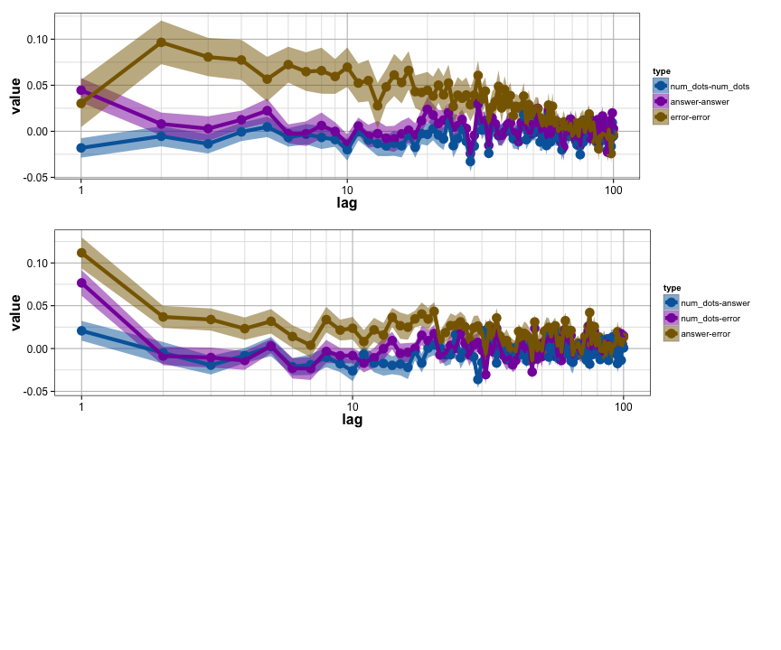
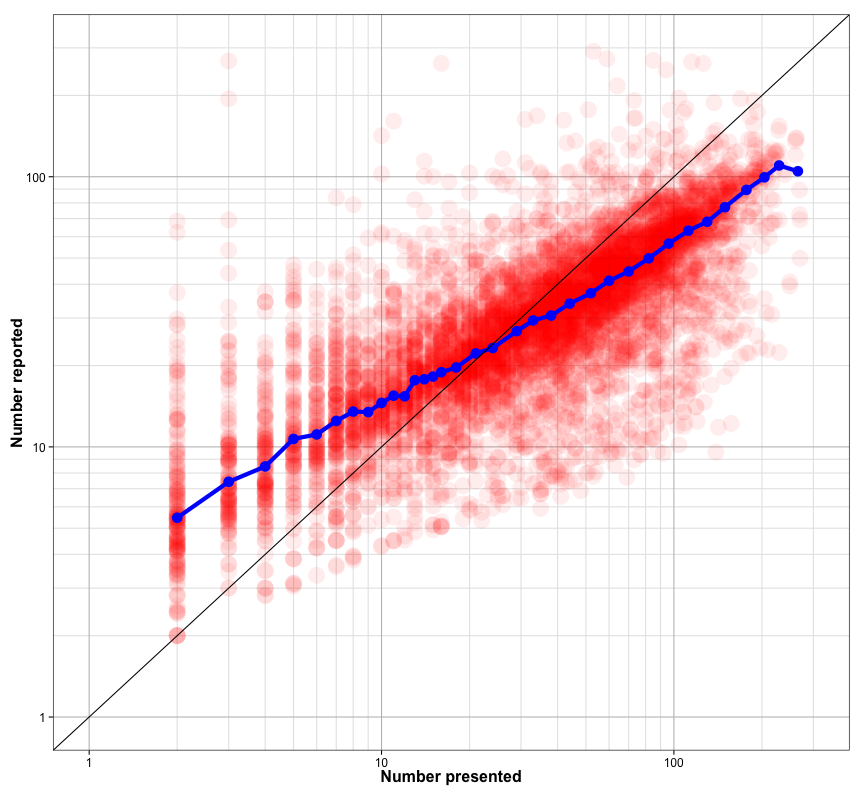
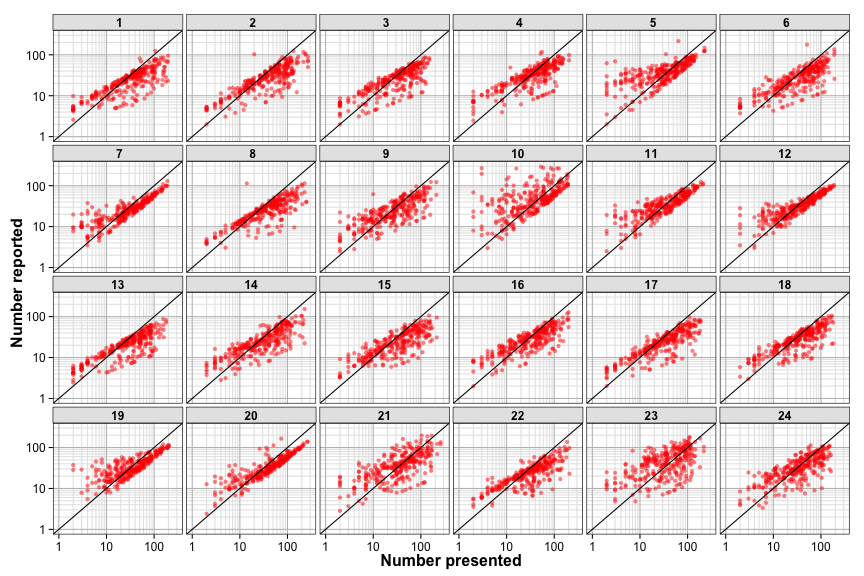

Number experiment analysis
========================================================

Experiment design
--------------------

24 subjects were presented with arrays of dots sampled from a ?? distribution.

They made two guesses about the number of dots on that trial.

Each array was presented twice (on different trials).

Read in and clean data
-------------------

(number subjects sequentially)


```r
setwd('~/PROJECTS/number-line/numexpt/R/')
rm(list=ls())

source('~/CODE/R/utilities.R')

files <- list.files('../data/')

dat <- data.frame()
subject <- 1
for(f in files){
  q = read.csv2(paste('../data/', f, sep=""), sep=",", header=T, colClasses="character")
  q$subject = subject
  dat <- rbind(dat, q)
  subject <- subject+1
}

to.num <- function(x){as.numeric(as.character(x))}
dat$run <- to.num(dat$run)
dat$index <- to.num(dat$index)
dat$num_dots <- to.num(dat$num_dots)
dat$answer1 <- to.num(dat$answer1)
dat$answer2 <- to.num(dat$answer2)
dat$points1 <- to.num(dat$points1)
dat$points2 <- to.num(dat$points2)
dat$time <- to.num(dat$time)
dat$answer <- 10^(log10(pmax(1, dat$answer1))/2+log10(pmax(1, dat$answer2))/2)

load('model.fits.Rdata')
```


```r
  ggplot(dat, aes(x=num_dots, y=answer))+
  # geom_line(data=predictions, aes(x=num_dots, y=bipred), color="red", alpha=0.5, size=2)+
  #geom_line(data=predictions, aes(x=num_dots, y=logpred), color="green", alpha=0.5, size=2)+
  geom_point(alpha=0.25, color="red")+
  geom_line(data=predictions, aes(x=num_dots, y=powpred), color="blue", size=1)+
  geom_abline(position="identity")+
  mylogx(c(1,300))+
  mylogy(c(1,300))+
  xlab("Number presented")+
  ylab("Number reported")+
  annotate("rect", xmin=1, xmax=5, ymin=1, ymax=300, fill="black", alpha=0.3)+
  mytheme+
  facet_wrap(~subject, ncol=6)
```

```
## Warning: Removed 1 rows containing missing values (geom_point).
## Warning: Removed 1 rows containing missing values (geom_point).
## Warning: Removed 1 rows containing missing values (geom_point).
## Warning: Removed 12 rows containing missing values (geom_point).
## Warning: Removed 2 rows containing missing values (geom_point).
## Warning: Removed 6 rows containing missing values (geom_point).
## Warning: Removed 5 rows containing missing values (geom_point).
## Warning: Removed 8 rows containing missing values (geom_path).
## Warning: Removed 133 rows containing missing values (geom_path).
```

 


```r
  ggplot(subset(dat, dat$subject==13 | dat$subject==23), aes(x=num_dots, y=answer))+
  # geom_line(data=predictions, aes(x=num_dots, y=bipred), color="red", alpha=0.5, size=2)+
  #geom_line(data=predictions, aes(x=num_dots, y=logpred), color="green", alpha=0.5, size=2)+
  geom_point(alpha=0.25, color="red", size=5)+
  geom_line(data=subset(predictions, predictions$subject ==13 | predictions$subject==23), aes(x=num_dots, y=bipred), color="blue", size=2)+
  geom_abline(position="identity")+
  mylogx(c(1,300))+
  mylogy(c(1,300))+
  xlab("Number presented")+
  ylab("Number reported")+
  annotate("rect", xmin=1, xmax=5, ymin=1, ymax=300, fill="black", alpha=0.3)+
  mytheme+
  facet_wrap(~subject, ncol=2)
```

```
## Warning: Removed 5 rows containing missing values (geom_point).
## Warning: Removed 132 rows containing missing values (geom_path).
```

 


```r
  ggplot(subset(dat, dat$subject==13 | dat$subject==23), aes(x=num_dots, y=answer))+
  # geom_line(data=predictions, aes(x=num_dots, y=bipred), color="red", alpha=0.5, size=2)+
  #geom_line(data=predictions, aes(x=num_dots, y=logpred), color="green", alpha=0.5, size=2)+
  geom_point(alpha=0.25, color="red", size=5)+
  geom_line(data=subset(predictions, predictions$subject ==13 | predictions$subject==23), 
            aes(x=num_dots, y=bipred), color=rgb(0, 0.6, 0), size=2)+
  geom_abline(position="identity")+
  mylogx(c(1,300))+
  mylogy(c(1,300))+
  xlab("Number presented")+
  ylab("Number reported")+
  annotate("rect", xmin=1, xmax=5, ymin=1, ymax=300, fill="black", alpha=0.3)+
  mytheme+
  facet_wrap(~subject, ncol=2)
```

```
## Warning: Removed 5 rows containing missing values (geom_point).
## Warning: Removed 132 rows containing missing values (geom_path).
```

 


```r
  ggplot(dat, aes(x=num_dots, y=answer))+
  # geom_line(data=predictions, aes(x=num_dots, y=bipred), color="red", alpha=0.5, size=2)+
  #geom_line(data=predictions, aes(x=num_dots, y=logpred), color="green", alpha=0.5, size=2)+
  geom_point(alpha=0.25, color="red")+
  geom_line(data=predictions, aes(x=num_dots, y=bipred), color=rgb(0, 0.6, 0), size=1)+
  geom_abline(position="identity")+
  mylogx(c(1,300))+
  mylogy(c(1,300))+
  xlab("Number presented")+
  ylab("Number reported")+
  annotate("rect", xmin=1, xmax=5, ymin=1, ymax=300, fill="black", alpha=0.3)+
  mytheme+
  facet_wrap(~subject, ncol=6)
```

```
## Warning: Removed 1 rows containing missing values (geom_point).
## Warning: Removed 1 rows containing missing values (geom_point).
## Warning: Removed 1 rows containing missing values (geom_point).
## Warning: Removed 12 rows containing missing values (geom_point).
## Warning: Removed 2 rows containing missing values (geom_point).
## Warning: Removed 6 rows containing missing values (geom_point).
## Warning: Removed 5 rows containing missing values (geom_point).
## Warning: Removed 35 rows containing missing values (geom_path).
## Warning: Removed 132 rows containing missing values (geom_path).
```

 


```r
p1  <- ggplot(dat, aes(x=num_dots, y=answer))+
  geom_point(alpha=0.25, size=5, color="red")+
  geom_abline(position="identity")
for(s in unique(predictions$subject)){
  p1 <- p1 + geom_line(data=subset(predictions, predictions$subject==s), aes(x=num_dots, y=bipred), color=rgb(0, 0.6, 0), alpha=0.5, size=2)

}
p1 <- p1 +  mylogx(c(1,300))+
  mylogy(c(1,300))+
  xlab("Number presented")+
  ylab("Number reported")+
  annotate("rect", xmin=1, xmax=5, ymin=1, ymax=300, fill="black", alpha=0.3)+
  mytheme
p1
```

```
## Warning: Removed 28 rows containing missing values (geom_point).
## Warning: Removed 35 rows containing missing values (geom_path).
## Warning: Removed 132 rows containing missing values (geom_path).
```

 


```r
ggplot(bipower.fits, aes(x=pmin(250, 10^a)))+
  geom_histogram(fill="red") +
  mylogx(c(1, 300))+
  xlab("Identity cutoff")+
  ylab("Number of subjects")+
  annotate("rect", xmin=1, xmax=5, ymin=0, ymax=4, fill="black", alpha=0.3)+
  mytheme
```

```
## stat_bin: binwidth defaulted to range/30. Use 'binwidth = x' to adjust this.
```

 


```r
# residuals

map.bipower <- function(x, a, b){
  crit <- a
  slope <- 10^b
  lx <- log10(x)
  ly <- ((lx>crit)*(crit+(lx-crit)*slope)+(lx<=crit)*lx);
  return(10^ly)
}

dat$bipred = 0
for(s in unique(dat$subject)){
  stims <- seq(1,300,by=1)
  tmp <- subset(dat, dat$subject==s)
  biparams <- bipower.fits[bipower.fits$subject==s,]
  bipred = (map.bipower(stims, biparams$a, biparams$b))
  dat$bipred[dat$subject==s] <- map.bipower(tmp$num_dots, biparams$a, biparams$b)
}

ggplot(dat, aes(x=num_dots, y=log10(answer)-log10(bipred)))+
  geom_point(alpha=0.25, color="red", size=2)+
  mylogx(c(1,300))+
  xlab("Number presented")+
  ylab("Log residuals")+
  # annotate("rect", xmin=1, xmax=5, ymin=1, ymax=300, fill="black", alpha=0.3)+
  mytheme+
  facet_wrap(~subject, ncol=6)
```

```
## Warning: Removed 2 rows containing missing values (geom_point).
## Warning: Removed 2 rows containing missing values (geom_point).
```

 
