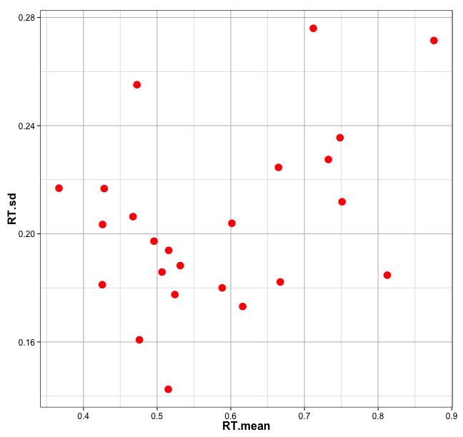
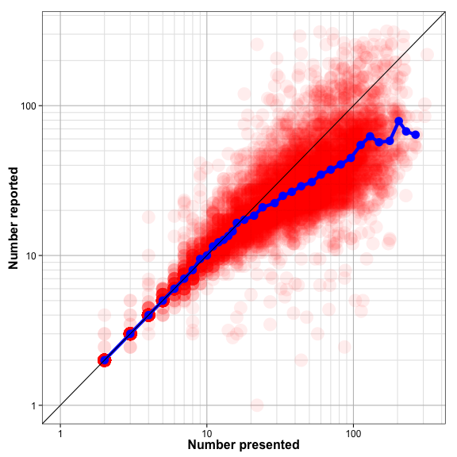

```r
source('~/PROJECTS/number-line/numexpt/R/load-numexpt-data.R')
```

```
## 
## Attaching package: 'reshape'
## 
## The following objects are masked from 'package:plyr':
## 
##     rename, round_any
```

```r
source('~/PROJECTS/number-line/numexpt/R/calculate-bin-stats.R')
```

Basic response/stimulus characteristics
---------------

Let's plot (a) presented/response histograms, 


```r
xlims <- c(1, maxn)
xbreaks <- my.log.breaks(xlims)

histplot <- ggplot(dat, aes(x=num_dots)) +
  geom_histogram(alpha=1.0, fill=maincol, binwidth=1) +
  geom_histogram(data=dat, aes(x=answer), fill=seccol, alpha=0.5, binwidth=1) +
  xlab("Number") +
  ylab("Frequency") +
  scale_x_continuous(limits=xlims, minor_breaks=10^xbreaks[[2]])+
  scale_y_continuous(minor_breaks=c())+
  mytheme
histplot
```

 

(b) mean/var of RT


```r
RTstats <- data.frame(do.call(rbind, by(dat, dat$subject, function(tmp){
  tmp <- log10(tmp$time)
  return(c(mean(tmp), sd(tmp)))})))
names(RTstats) <- c("RT.mean", "RT.sd")

rtplot <- ggplot(RTstats, aes(x=RT.mean, y=RT.sd))+
  geom_point(col=maincol, size=5)+
  mytheme

rtplot
```

 


Plot calibrations
-----------------

Overall response-presented scatter plot and bin medians.


```r
xlims <- c(1, maxn)
p1 <- ggplot(dat, aes(x=num_dots, y=answer))+
  geom_point(alpha=0.07, colour=maincol, size=8)+
  geom_point(data=bin.stats, aes(x=truens, y=medians), colour=seccol, size=5)+
  geom_line(data=bin.stats, aes(x=truens, y=medians), colour=seccol, size=2)+
  geom_abline(position="identity")+
  mylogx(xlims)+
  mylogy(xlims)+
  xlab("Number presented")+
  ylab("Number reported")+
  mytheme
p1
```

```
## Warning: Removed 21 rows containing missing values (geom_point).
```

 


```r
xlims <- c(1, maxn)
rtplot <- ggplot(bin.stats, aes(x=truens, y=RT))+
  geom_point(colour=maincol, size=5)+
  geom_line(aes(x=truens, y=RT), colour=maincol, size=2)+
  mylogx(xlims)+
  scale_y_continuous()+
  xlab("Number presented")+
  ylab("Response time (seconds)")+
  mytheme

erplot <- ggplot(bin.stats, aes(x=truens, y=acc))+
  geom_point(colour=maincol, size=5)+
  geom_line(aes(x=truens, y=acc), colour=maincol, size=2)+
  mylogx(xlims)+
  scale_y_continuous()+
  xlab("Number presented")+
  ylab("Error proportion")+
  mytheme

 gA <- ggplotGrob(rtplot)
 gB <- ggplotGrob(erplot)
 maxWidth = grid::unit.pmax(gA$widths[2:5], gB$widths[2:5])
 gA$widths[2:5] <- as.list(maxWidth)
 gB$widths[2:5] <- as.list(maxWidth)
 grid.arrange(gA, gB, ncol=1)
```

 


Plotting individual subjects.


```r
xlims <- c(1, maxn)
ggplot(dat, aes(x=num_dots, y=answer))+
  geom_point(alpha=0.5, colour=maincol)+
  geom_abline(position="identity")+
  mylogx(xlims)+
  mylogy(xlims)+
  xlab("Number presented")+
  ylab("Number reported")+
  mytheme+
  facet_wrap(~subject, ncol=6)
```

```
## Warning: Removed 1 rows containing missing values (geom_point).
## Warning: Removed 1 rows containing missing values (geom_point).
## Warning: Removed 1 rows containing missing values (geom_point).
## Warning: Removed 9 rows containing missing values (geom_point).
## Warning: Removed 4 rows containing missing values (geom_point).
## Warning: Removed 5 rows containing missing values (geom_point).
```

 

