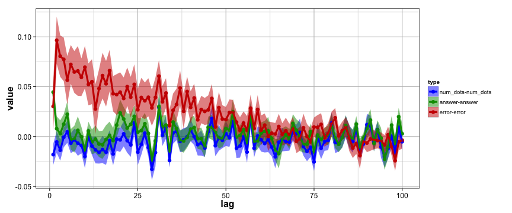
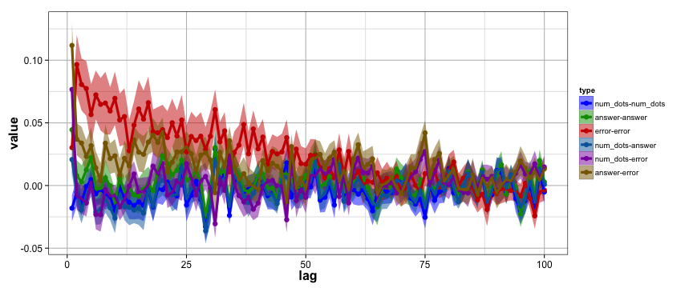

```r
source('~/PROJECTS/number-line/numexpt/R/load-numexpt-data.R')
```

```
## 
## Attaching package: 'reshape'
## 
## The following objects are masked from 'package:plyr':
## 
##     rename, round_any
```

```r
source('~/PROJECTS/number-line/numexpt/R/time-correlations.R')
```

Correlations over time.
-------

Now let's make some plots


```r
r = 0.8
g = 0.6
b = 1

mylevelcolors <- data.frame(ls = c("num_dots-num_dots",
                                   "answer-answer",
                                   "error-error",
                                   "num_dots-answer",
                                   "num_dots-error",
                                   "answer-error"),
                            cs = c(rgb(0,0,b), 
                                   rgb(0,g,0), 
                                   rgb(r,0,0), 
                                   rgb(0,g/1.5, b/1.5), 
                                   rgb(r/1.5, 0, b/1.5), 
                                   rgb(r/1.5, g/1.5,0)))

crosscors$type <- factor(crosscors$type, levels=mylevelcolors$ls)

use = 1:3
tmp <- subset(crosscors, crosscors$type %in% mylevelcolors$ls[use])

ggplot(tmp, aes(x=lag, y=value, color=type, fill=type))+
  stat_summary(fun.data=mean_se, 
               geom="ribbon", 
               alpha=0.5, colour=NA) +
  stat_summary(fun.y=mean, 
               geom="point", 
               size=3) +
  stat_summary(fun.y=mean, 
               geom="line", 
               size=1.5)+
  scale_fill_manual(values=as.character(mylevelcolors$cs[use]))+
  scale_color_manual(values=as.character(mylevelcolors$cs[use]))+
  #mylogx(c(1,nlags))+
  mytheme
```

 

```r
use = 1:6
tmp <- subset(crosscors, crosscors$type %in% mylevelcolors$ls[use])
ggplot(tmp, aes(x=lag, y=value, color=type, fill=type))+
  stat_summary(fun.data=mean_se, 
               geom="ribbon", 
               alpha=0.5, colour=NA) +
  stat_summary(fun.y=mean, 
               geom="point", 
               size=3) +
  stat_summary(fun.y=mean, 
               geom="line", 
               size=1.5)+
  scale_fill_manual(values=as.character(mylevelcolors$cs[use]))+
  scale_color_manual(values=as.character(mylevelcolors$cs[use]))+
  #mylogx(c(1,nlags))+
  mytheme
```

 
